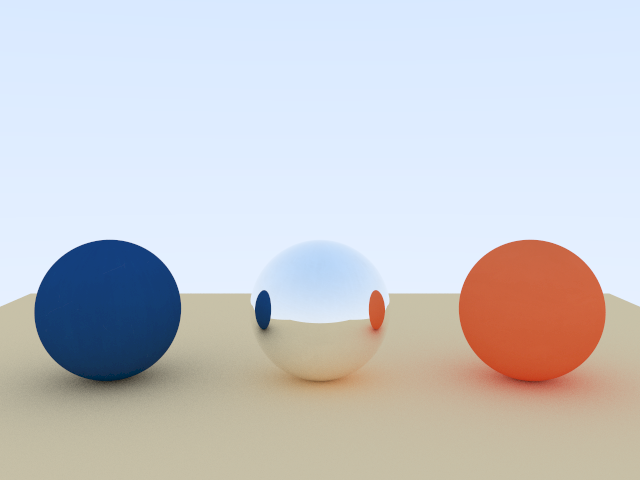
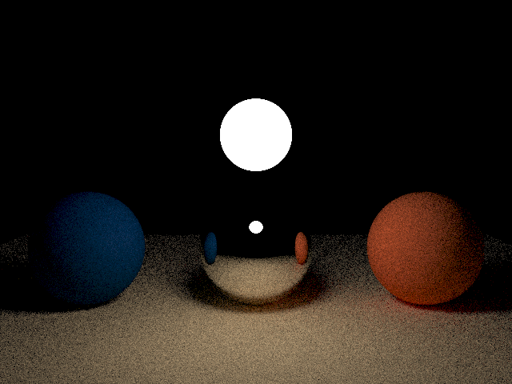
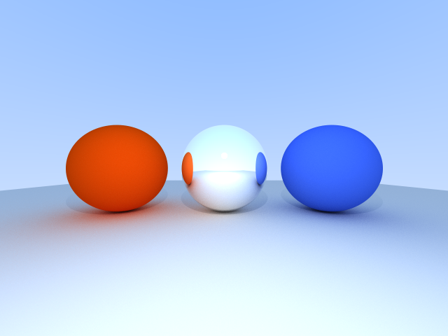
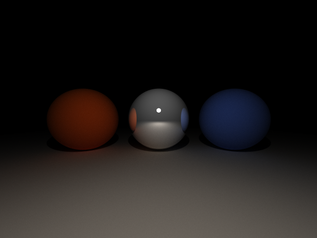

# RayTracingCpp

RayTracingCpp is a ray tracing renderer developed as part of a university project, agreed upon with the professor during class. The goal is to implement a ray tracer in C++ in two main stages:

1. **CPU Version**: The fundamentals of ray tracing are first developed and executed on the CPU.
2. **GPU Version**: The project is then ported to the GPU using Vulkan compute shaders in a headless configuration. This approach was chosen because my GPU (AMD RX 590) does not support hardware ray tracing, making compute shaders the most suitable solution.

The project aims to provide a clear and modular implementation of ray tracing techniques, with a focus on both

---

## 🔧 Build Instructions

The `main` branch contains the CPU-only implementation. The only requirement is to use **C++20**.

To build the project:

1. Open a terminal and navigate to the root directory (where the `CMakeLists.txt` file is located).
2. Run the following command to generate the build files:
  ```
  cmake -S . -B build/
  ```
3. Enter the `build/` directory and compile:
  ```
   make
  ```
4. If everything went well, execute the program:
  ```
   ./build/RayTracingCpp
  ```


The `vulkan` branch contains the GPU porting with Vulkan. For this version, you must have the **Vulkan-SDK** installed on your system. To build the GPU version:
1. Make sure you are on the `vulkan` branch.
2. Navigate to the `/shaders` directory.
3. Compile the compute shader into SPIR-V using the Vulkan shader compiler `glslc`:
  ```
  glslc ray_tracer.comp -o ray_tracer.comp.spirv
  ```
4. Return to the project's root directory and generate the build files:
  ```
  cmake -S . -B build/
  ```
5. Enter the `build/` directory and compile:
  ```
   make
  ```
6. If everything went well, execute the program:
  ```
   ./build/RayTracingCpp
  ```

## 🖼️ Results

Below are some example images rendered by the algorithm:

### CPU Implementation


*Scene with three spheres: two with Matte material, one with Metal material, and a plane with Matte material.
Generated with **512 samples per pixel**.*


*Scene in the dark with the same three spheres and plane, plus an additional sphere with Emissive material acting as a light source.
Generated with **512 samples per pixel**.*

### GPU Implementation


*Scene with the same three spheres and plane, plus an additional sphere with Emissive material acting as a light source.
Generated with **1024 samples per pixel**.*


*Scene in the dark with the same three spheres and plane, plus an additional sphere with Emissive material acting as a light source.
Generated with **1024 samples per pixel**.*

## ✨ Features (CPU Version)

- Implemented materials: **Metal**, **Matte**, and **Emissive**
- No BVH acceleration structure implemented
- Supports both **direct** and **indirect illumination**
- Scene objects: only **Sphere** and **Plane** are implemented
- No external libraries used except for **stb_image**
- Texture mapping is supported
- **Multi-threaded rendering** for improved performance

## 📚 References
- [Ray Tracing in One Weekend](https://raytracing.github.io/books/RayTracingInOneWeekend.html) – Peter Shirley, Trevor David Black, Steve Hollasch
- [Ray Tracing: The Next Week](https://raytracing.github.io/books/RayTracingTheNextWeek.html) – Peter Shirley, Trevor David Black, Steve Hollasch
- Professor's textbook (course material)
- [Vulkan Tutorial](https://vulkan-tutorial.com/)